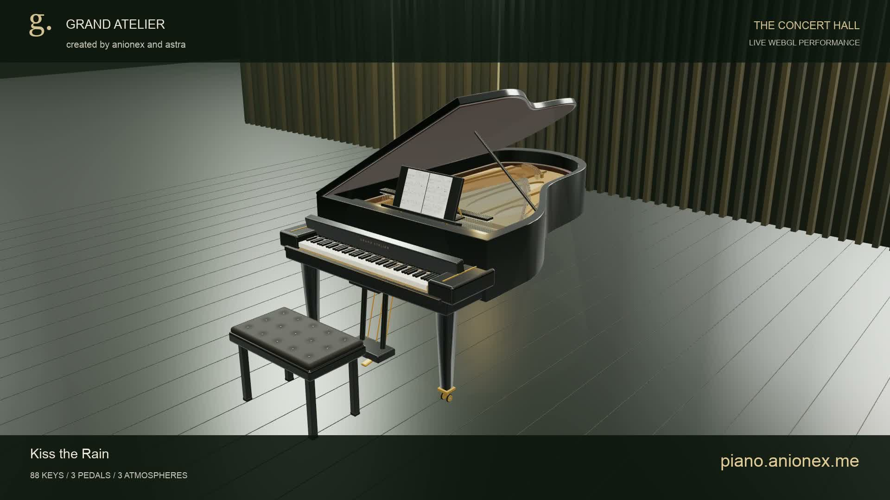

# Grand Atelier

A playable grand piano in your browser, created by [anionex](https://github.com/Anionex) and astra.

**[Play online](https://piano.anionex.me/) · [Watch the demo](https://github.com/Anionex/grand-atelier/releases/download/v1.0.0/grand-atelier-demo.mp4)**

[](https://github.com/Anionex/grand-atelier/releases/download/v1.0.0/grand-atelier-demo.mp4)

- 88 interactive keys, three pedals, and visible hammer / damper motion.
- Three modeled environments: concert hall, daylight studio, and moonlit terrace.
- Mouse, touch, and keyboard playing; MIDI import, seeking, and automatic score-page turns.
- English / Chinese UI, immersive mode, and a collapsible mobile keyboard.

Built with Three.js, React, Web Audio, and VexFlow. The mechanics are a procedural visualization, not an engineering CAD replica; MIDI transcription is not a replacement for an engraved original score. The video shows an earlier version of the live site.

## Run locally

Node.js 22.13+:

```sh
npm ci
npm run dev
```

Open the URL printed in your terminal and enable sound. Drag to orbit; click piano keys to play. `A W S E D F T G Y H U J K O L P ; ' ] \` plays consecutive notes. Arrow keys change octaves; left `Shift`, right `Shift`, and `Space` control soft, sostenuto, and sustain pedals.

```sh
npm test
npm run typecheck
npm run build     # Static website in dist/client; serve with any static host
npm run preview
```

## Assets & license

Code and original procedural artwork: [MIT](LICENSE). Piano samples: Alexander Holm's **Salamander Grand Piano**, [CC BY 3.0](https://creativecommons.org/licenses/by/3.0/); see [attribution](public/audio/ATTRIBUTION.txt).

Purchased MIDI arrangements are **not included**. This edition starts with the original *Atelier Prelude*. Import your own `.mid` file locally; files are not uploaded. The live site's repertoire and demo recording are not covered by the code license.
